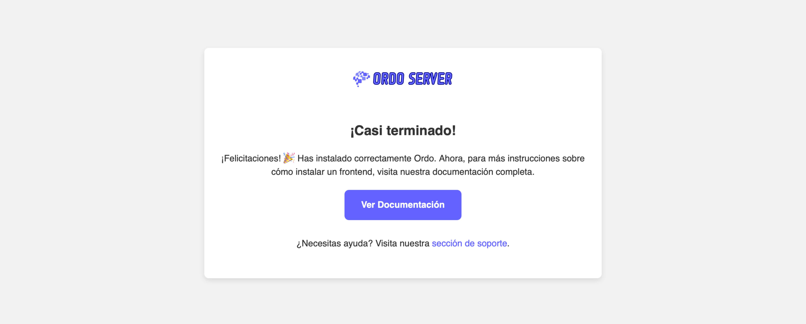

# 🌐 **Ordo: Backend Descentralizado para Redes Sociales – Basado en Pleroma** 🚀

**Ordo** es un backend descentralizado y de código abierto, construido sobre el código base de **Pleroma**. Este proyecto está diseñado específicamente para alimentar redes sociales federadas como **Fedired**, proporcionando una plataforma robusta que se enfoca en la privacidad y la seguridad de los usuarios, mientras permite una integración fluida con el Fediverso mediante el protocolo **ActivityPub**.

  
    

  
    

  

---

## 🚀 **¿Por Qué Usar Ordo?**

Ordo es una plataforma diseñada para ser versátil, eficiente y accesible, no solo para administradores experimentados de redes sociales federadas, sino también para estudiantes, desarrolladores y comunidades. Aquí te presentamos algunos de los usos y beneficios más destacados:

### **🌱 Para Estudiantes y Educadores**
- **Aprendizaje práctico**: Explora cómo funcionan las redes descentralizadas, el protocolo **ActivityPub** y las tecnologías detrás del Fediverso.
- **Creación de proyectos académicos**: Usa Ordo para desarrollar redes sociales enfocadas en comunidades específicas o temáticas.
- **Cursos y talleres**: Ideal para enseñar sobre descentralización, privacidad y escalabilidad en sistemas distribuidos.
- **Hackatones y proyectos de investigación**: Diseña prototipos de redes sociales innovadoras y experimenta con nuevas características.

### **💻 Para Desarrolladores**
- **Personalización avanzada**: Ordo es de código abierto, permitiéndote adaptar la plataforma a tus necesidades específicas.
- **Participación en comunidades de código abierto**: Contribuye al proyecto y mejora tus habilidades técnicas en **Elixir** y **Erlang**.
- **Pruebas y desarrollo escalable**: Experimenta con configuraciones para pequeñas o grandes instancias.

### **🌐 Para Comunidades**
- **Redes sociales locales o temáticas**: Construye espacios digitales adaptados a necesidades específicas de tu comunidad.
- **Promoción de la privacidad**: Protege los datos de tus usuarios con configuraciones avanzadas de seguridad.
- **Conexión global**: Participa en el Fediverso y permite que tus usuarios interactúen con otras plataformas descentralizadas.

---

## ⚙️ **Características Principales**

- **Basado en Pleroma**: Arquitectura ligera y eficiente, adaptada para un rendimiento óptimo.
- **Soporte completo para ActivityPub**: Integra y conecta tu red social con el Fediverso.
- **Optimizado para la escalabilidad**: Ideal para instancias pequeñas o redes de gran tamaño.
- **Privacidad y seguridad mejoradas**: Opciones avanzadas para proteger la integridad de tu red y la información de tus usuarios.
- **Código abierto y colaborativo**: Disponible para personalizar y mejorar según las necesidades de tu comunidad.

---

## 🛠️ **Documentación y Recursos**

- **[Repositorio Oficial en GitHub](https://github.com/fedired-dev/ordo)**  
- **[Guía de Instalación](https://github.com/fedired-dev/ordo/blob/main/docs/ordo/install.md)**  

---

¡Explora, personaliza y construye con Ordo! 🎉
